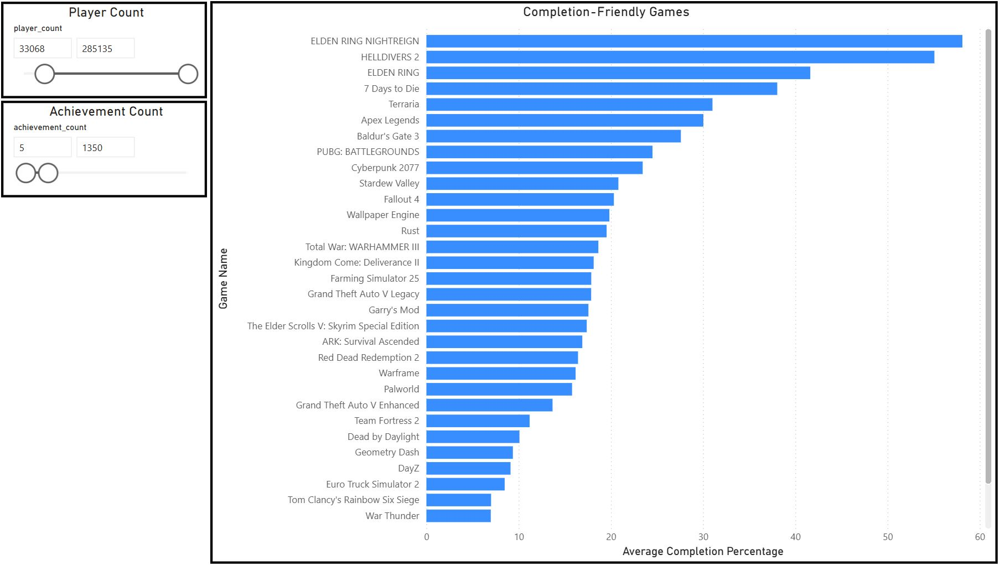
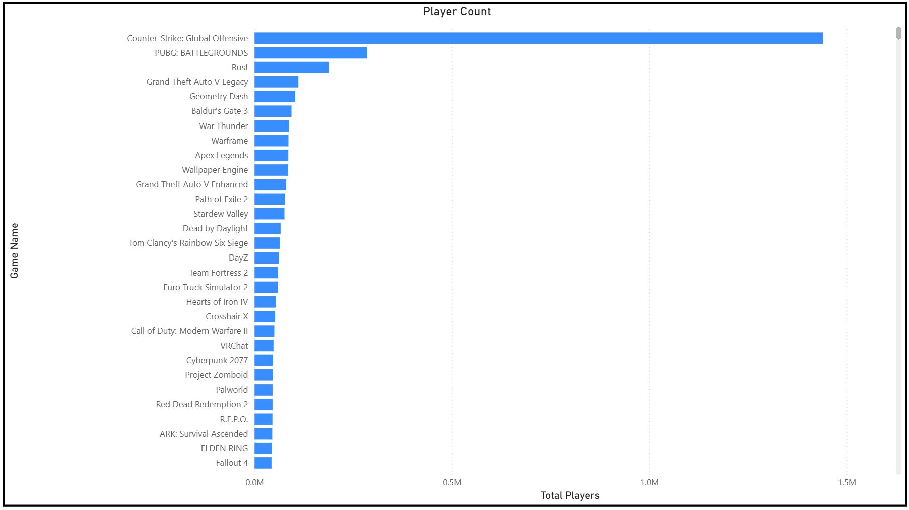
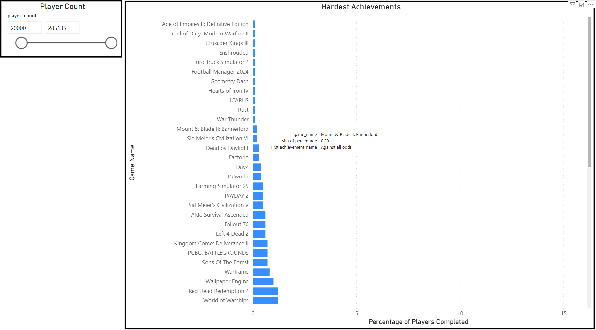

# Databricks Achievements – Steam API Pipeline

This repository is an end-to-end medallion architecture data pipeline built on **Databricks**, using both the **Steam Web API** and **SteamSpy API** as data sources.  
Upon completion of the ingestion process the user will have delta tables containing:

- ~87,000 unique games/applications
- ~1.8 million rows of achievement data

## Purpose

The purpose behind this was to gather data on achievements for all of the games available in the Steam library and answer the following questions:

- Which games have the most difficult achievements?
- Which games are the easiest to 100% complete?
- What is the achievement breakdown for each game?

## Python Modules (`src/`)

The `src` directory contains reusable pipeline logic that can be imported into Databricks notebooks.

### Configuration
- **`config/settings.py`**
  Configuration file where settings and API data can be changed.

### Steam Pipeline Logic
- **`steam/client.py`**
  Client for interacting with the Steam Web API.

- **`steam/bronze.py`**
  Functions responsible for raw data ingestion and schema handling.

- **`steam/silver.py`**
  Transformation logic for cleaning and standardizing game data.

- **`steam/gold.py`**
  Aggregation and business logic for Gold-layer outputs.

##  Setup

1. Import the repo into Databricks.
2. Configure any required settings in `src/config/settings.py`.
3. Run notebooks in order:
   1. Bronze
   2. Silver
   3. Gold

##  API Usage Warning

Steam enforces a limit of 100,000 API calls per 24 hours per key/IP.

Both of the following ingestion steps can consume ~87,000 calls each:

- `pull_player_count_steam()`
- `pull_achievements_steam()`

SteamSpy does include a current player count and a range of owners for each game in their `request=all`.  
However, after reviewing these numbers it is clear that they are extremely innacurate/unreliable and often just return null.  
Because of this I have opted to use Steam's `GetNumberOfCurrentPlayers` from their official API.

### Recommended execution order

1. Run `pull_player_count_steam()`
2. Wait **24 hours** (to reset Steam API limits)
3. Run `pull_achievements_steam()`

##  PowerBI Charts

